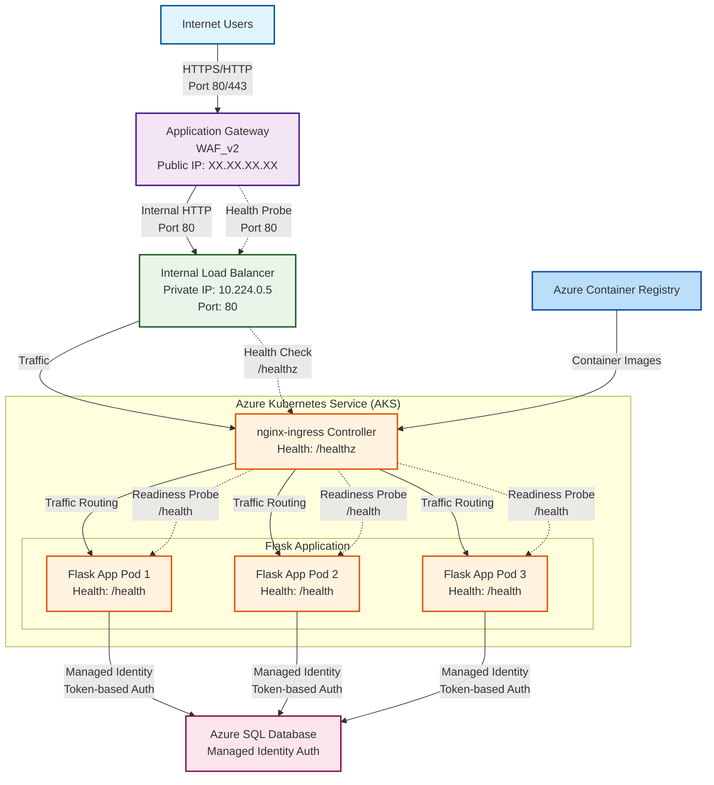

# Application Architecture

## System Overview



## Architecture Explanation

### Flow Description:
1. **External Traffic**: Internet users access via HTTPS/HTTP
2. **Application Gateway**: Azure WAF_v2 provides security
3. **Internal Load Balancer**: Distributes traffic within VNET
4. **Kubernetes**: nginx-ingress routes to Flask pods
5. **Database**: Azure SQL with managed identity
6. **Registry**: ACR stores container images

### Key Features:
- ✅ WAF protection
- ✅ Private networking
- ✅ Managed identity authentication
- ✅ Health monitoring at every layer
- ✅ High availability with multiple pods
```
